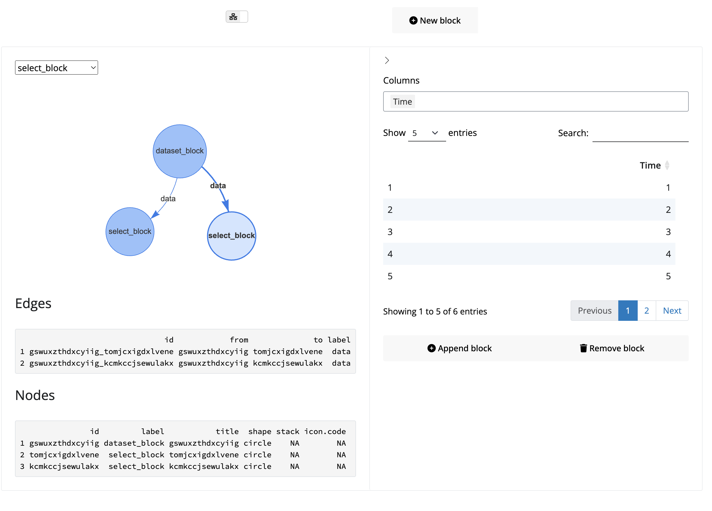

<!-- README.md is generated from README.Rmd. Please edit that file -->

```{r, include = FALSE}
knitr::opts_chunk$set(
  collapse = TRUE,
  comment = "#>",
  fig.path = "man/figures/README-",
  out.width = "100%"
)
```

# blockr.ui

<!-- badges: start -->
<!-- badges: end -->

The goal of blockr.ui is to provide a user interface for `{blockr.core}`.

## Installation

You can install the development version of blockr.ui from [GitHub](https://github.com/) with:

``` r
# install.packages("devtools")
devtools::install_github("cynkra/blockr.ui")
```

## Example

This is a basic example which shows you how to solve a common problem:

```{r, eval=FALSE, echo = TRUE}
library(blockr.ui)
library(bslib)
library(shiny)

ui <- page_fillable(
  main_ui("board")
)

server <- function(input, output, session) {
  main_server("board")
}

shinyApp(ui, server)
```

