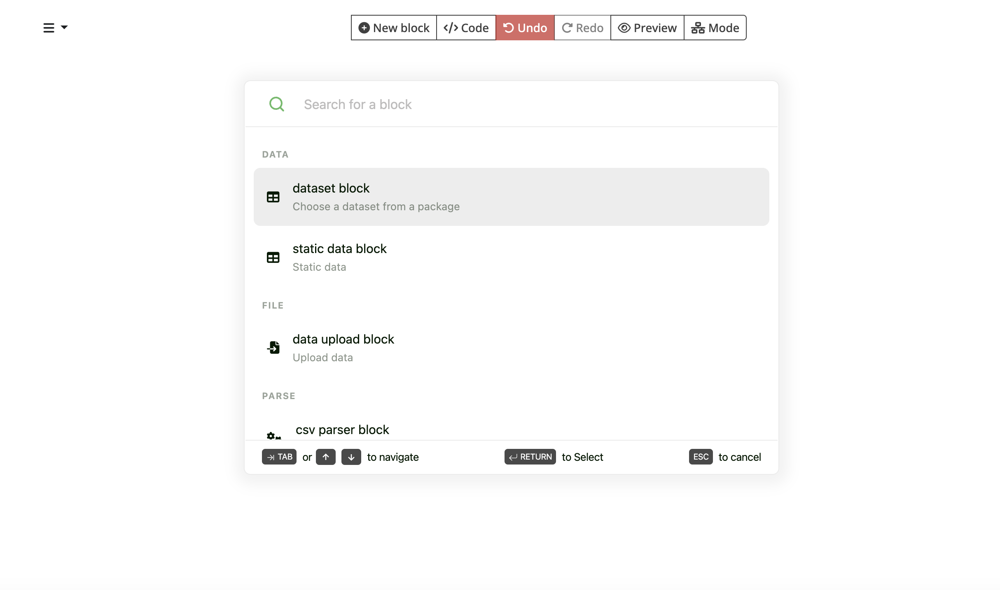
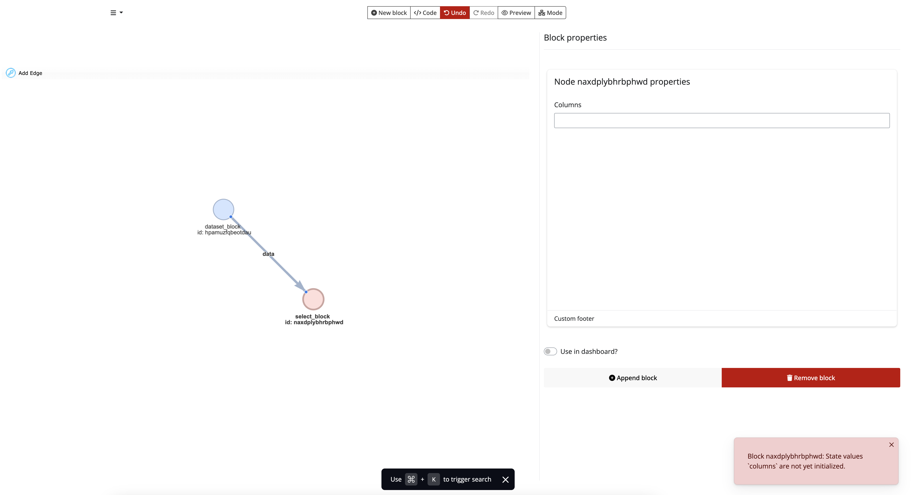
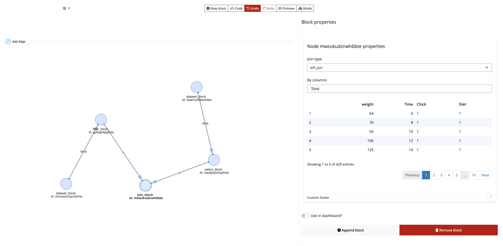
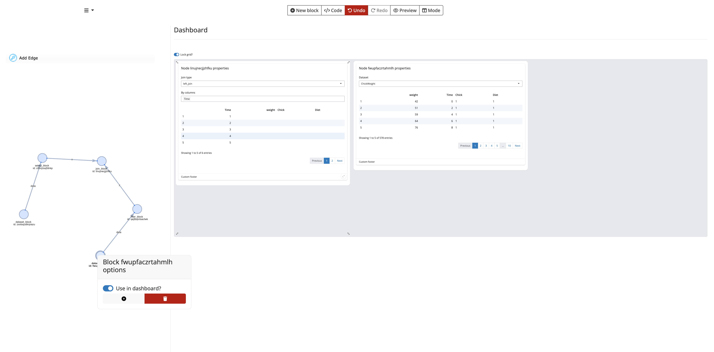

<!-- README.md is generated from README.Rmd. Please edit that file -->

# blockr.ui

<!-- badges: start -->

[](https://lifecycle.r-lib.org/articles/stages.html#experimental)
[](https://github.com/cynkra/blockr.ui/actions/workflows/ci.yml)
[](https://CRAN.R-project.org/package=blockr.ui)
<!-- badges: end -->

The goal of blockr.ui is to provide an alternative user interface for
`{blockr.core}`.

## Installation

You can install the development version of blockr.ui from
[GitHub](https://github.com/) with:

``` r
# install.packages("devtools")
devtools::install_github("cynkra/blockr.ui")
```

## Example

To run the demo app:

``` r
library(blockr.dplyr)
library(blockr.ui)

run_demo_app()
```

### Create a new block



### Block properties


### Append block and invalid state



### Join independant data



### Rearrange output on a grid


